# Udacity Project 2 - Chad Puterbaugh

## Project Overview

### Project Purpose
This project seeks to provide an application for a bank to predict whether a particular customer will be responsive to a given marketing campaign. Using historical examples, the project utilizes an AutoML classifier to train a model to make these predictions. AutoML is a convenient service that attempts to find an optimal arrangement of algorithms and hyperparameters to solve best fit the data presented. The resulting model is then packaged as an endpoint to be an accessible way for the bank to make new inferences against the model. The project then packages this model in an Azure Container Instance, complete with all of the input/output functionality to make an active endpoint. In this way, we publish a container that will now serve as a convenient prediction engine with the versatility of an API. An API can serve any manner of connectivity that the larger bank infrastructure may require. 

### Components

This project utiizing the following components to produce the background for an application:
Training Pipeline - Retrieves a dataset, invokes AutoML to create classifier model, create a confusion matrix on the given model with test data, and lastly publish the pipeline for reuse and potentially to trigger a subsequent pipeline run. 
AutoML - Creates a classifier model for consumption
Swagger - Provide automated documentation for API Endpoint, supported locally using docker

## Architectural Diagram
The following diagram shows the MLOps process for value delivery. It depicts the training pipeline and how the outputs are served to customers. 

## Improvement Ideas
In future pipelines, I think I would like to adjust the exit criteria for AutoML to ensure that a better model is not overlooked due to running out of time. We could potentially improve the performance of the search by registering a stronger, multi-cored GPU to train, but keep the costs low by deleted the VM after use. 

Because we have established a full training pipeline for this project, another improvement could be to schedule the pipeline to re-run once the bank marketing dataset is updated to a new version. Doing this would allow us to have an up-to-date model based on the latest data available. 

Other ideas would be to codify data translation steps that may need to be better articulate, for instance changing some varibles into booleans or using one-hot encoding. 

Lastly We could improve the model performance by paying attention to data guidelines that AutoML produces to reduce the likelihood of over or underfitting in the resulting model. For instance, when I ran AutoML with the provided data, I got a guideline warning regarding relative examples of positive vs. negative Y values. Heeding these suggestions and creating future versions of datasets will help create consistently better models. 

## Standout Suggestions
N/A

## Key Steps

### Register Dataset
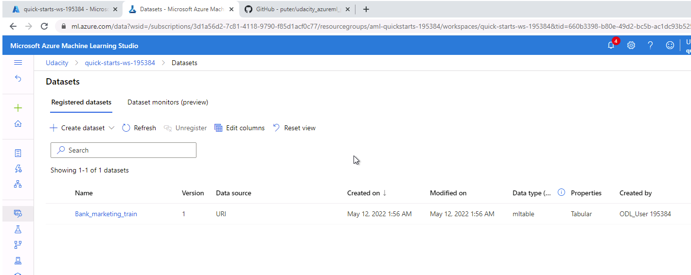
Using Azure ML Studio, we can register a dataset for use, reuse, and version control of data for MLOps. This enables us to abstract the access to data, while keeping versions organized.

### AutoML Experiment
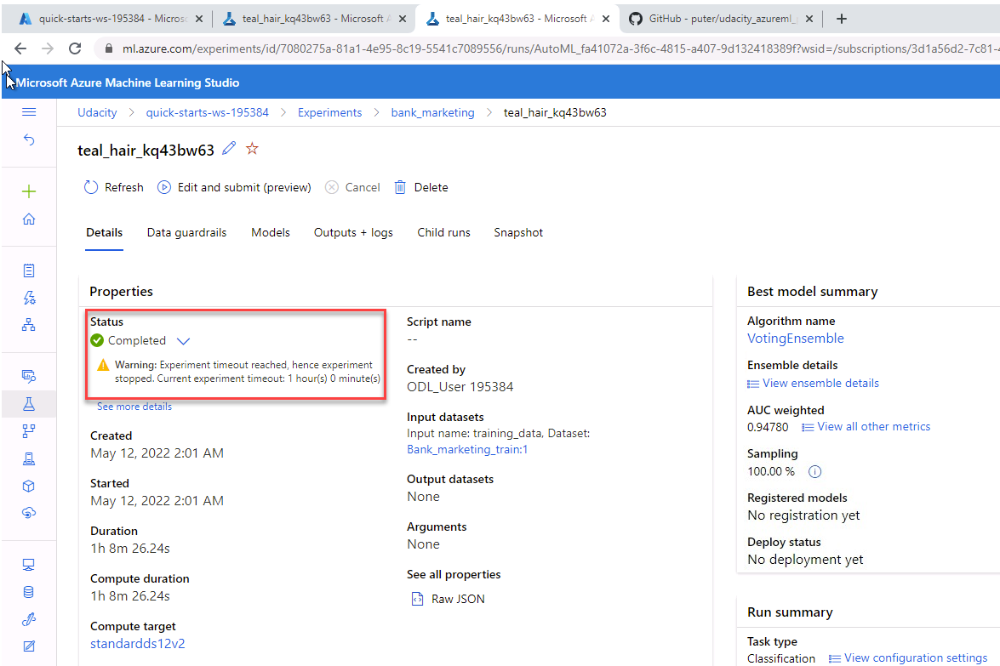
Using AutoML, we tell Azure what kind of problem we are interested in solving, and some parameters to solve it. For instance, here we frame the problem as a classification problem, and tell the AutoML engine not to run longer than an hour, for instance. Using these and other parameters, AutoML utilizes a variety of algorithms and hyperparameters to more or less brute force a solution that best meets our acceptance criteria (in this example, optimizes for Accuracy). 

### Best Model
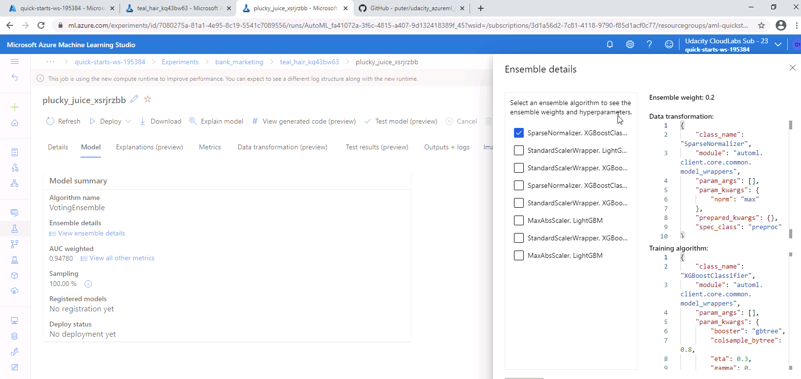
The outputs of AutoML are the artifacts that represent the best model, as well as logging of various outputs we care about. The best model can be published into an Azure Container Registry, and implemented into a variety of environments to serve as needed. 

### Application Insights
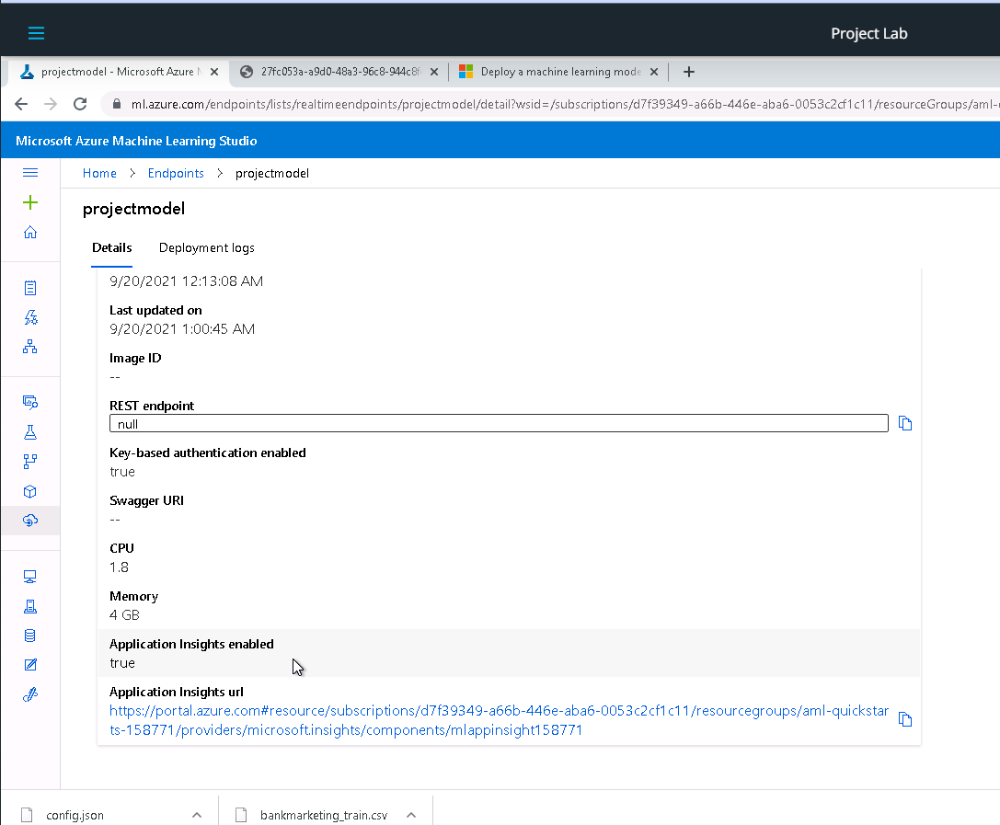
We can ennable Application Insights within the container to ensure we have appropriate environment logging for future debugging.

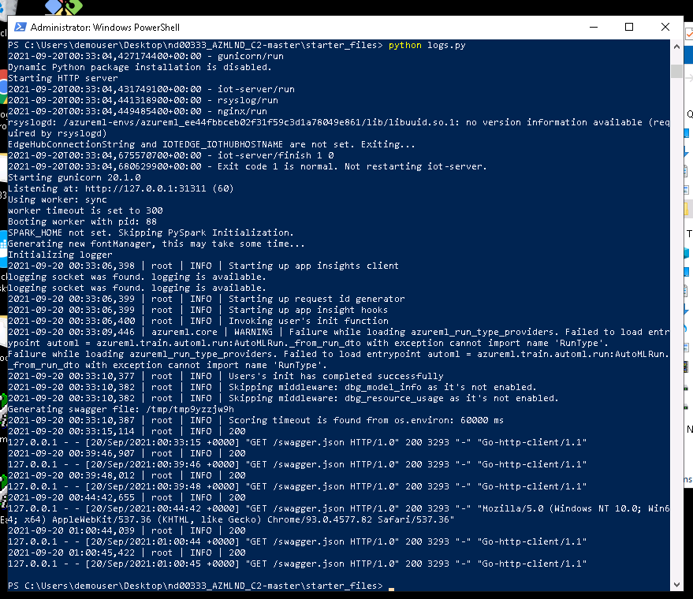
An example of the logging data available.

### Swagger Documentation
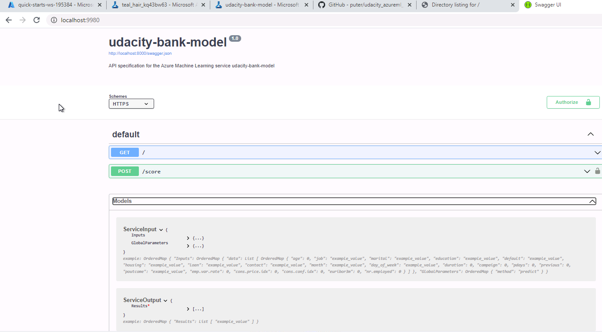
The model registering process also produces automatic documentation in the form of Swagger. See resulting documentation above.

### Endpoint
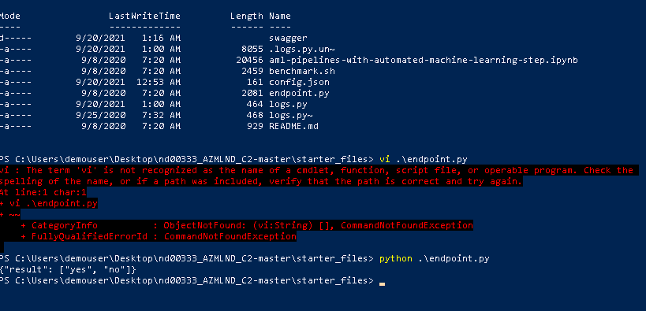
Here we can see the API Endpoint working as intended.

### Training Pipeline
The training pipeline is created for an MLOps process to facilitate versoin control and coordinated retraining of models. Data is likely to change throughout the lifetime of a project, and so models will need to be retrained when this happens to continue to service the consumers. A pipeline allows us to codify steps to retrain a model (in this case) to automate that retraining phase. See below as a created pipeline.
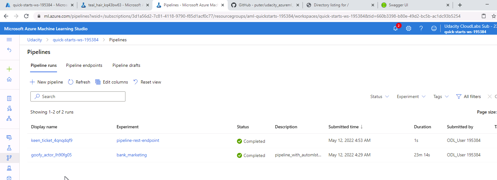
This picture also depicts the pipeline run that was scheduled and executed.
 
 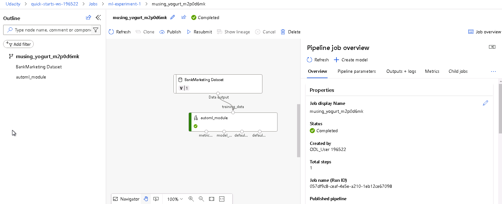
This shows the pipeline run completed.

The pipeline scaffolding comes complete with an API to allow remote execution of said pipeline. This would allow us to run, stop, and get statistics from a pipeline to facilitate an MLOps process. See below for pipeline endpoint:
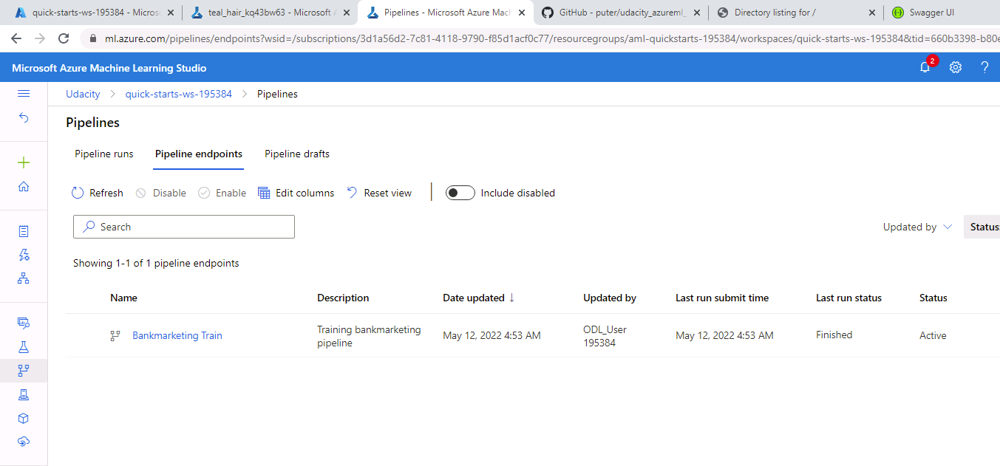
The picture also depicts the pipeline endpoint in an 'Active' status.

Here the steps of the pipeline are depicted graphically:
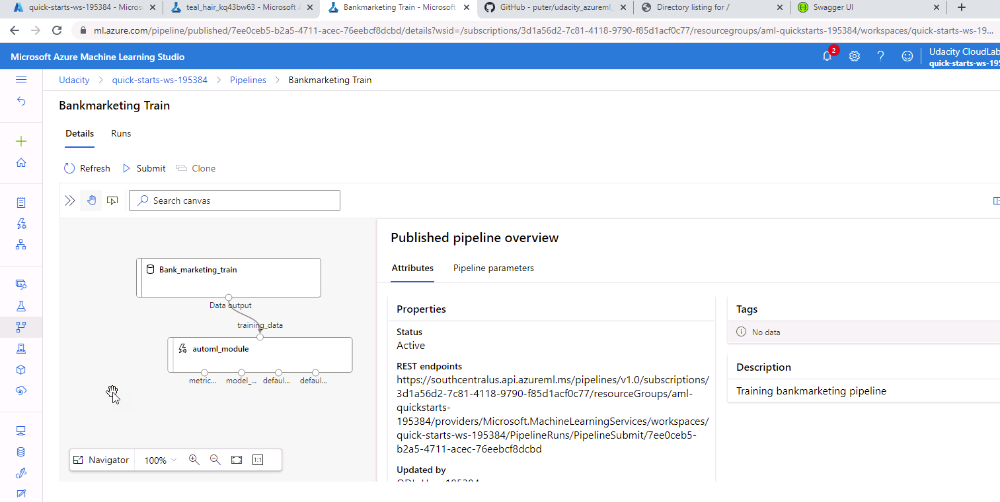

Here is an example of output logging provided by the pipeline notebook.
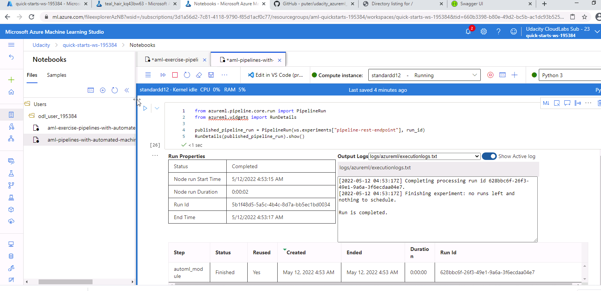

## Screen Recording
See this youtube video for a screencast of the project parameters
https://youtu.be/0pKM4fRwPh8

